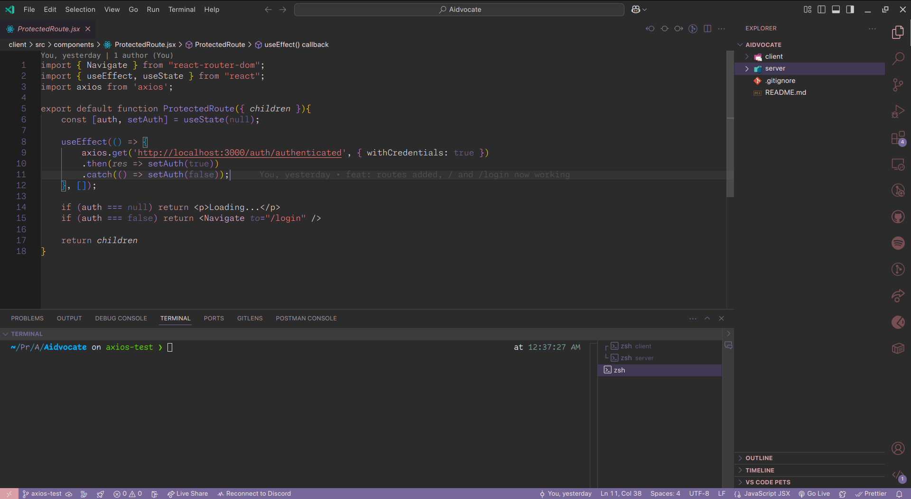

# Mashu Theme for VSCode

A soft, elegant, pastel dark theme inspired by the **Mashu** theme from Monkeytype.

> Subtle purples, smooth pinks, and a calming code environment.

## 🖼️ Preview



## 🎨 Features

- Clean, minimal, and readable
- Soft purple-pink palette for low eye strain
- Carefully selected syntax highlighting for clarity

## 🛠️ Installation

### From Marketplace

> Not published yet — coming soon.

---

### 📥 From GitHub Releases

1. Go to the [Releases](https://github.com/exdarku/mashu-theme/releases) page.
2. Download the latest `.vsix` file (e.g. `mashu-theme-0.0.1.vsix`)
3. Open VSCode
4. Open Command Palette (`Ctrl+Shift+P` / `Cmd+Shift+P`)
5. Select: `Extensions: Install from VSIX...`
6. Choose the `.vsix` file you downloaded
7. Select **"Mashu"** as your new theme in `Preferences > Color Theme`

---

### 🧪 Local Installation from Source

1. Clone or download this repository
2. Run the following in the project directory:

   ```bash
   npm install -g vsce
   vsce package
